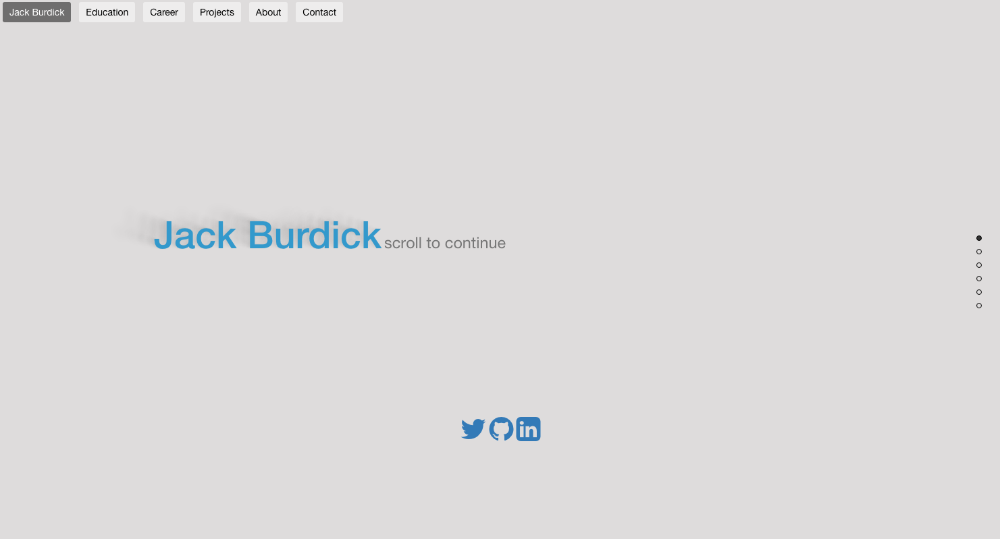

# Personal Portfolio

## Information
* School
  * FAU
* Class
  * COP4854
* Professor
  * Dr Marques
* Assignment
  * Assignment 1 - web portfolio

## Assignment Goal
> Design	a	simple,	responsive,	visually	pleasant, web	page that	could	serve	as	your	online professional	portfolio	/	resume,	using	HTML5,	CSS, Bootstrap,	JavaScript,	and	jQuery."

## Grading Criteria
* Overall	presentation (alignment, colors, fonts,	images,	etc.): 20%
* Overall	organization and richness	of content: 20%
* Separation	between	presentation,	content,	and	interactivity 10%
* Proper use of HTML: 10%
* Proper use of CSS: 10%
* Proper use of Bootstrap: 10%
* Proper use of JavaScript	and	jQuery: 10%
* Report 5%
* Available	live on lamp.cse.fau.edu 5%

## Minimum Requirements
* Must be our own work
* Must be available on lamp.cse.fau.edu

## Personal Goal
* Use github for the first time on a project
* Explore and use a variety of other github Projects
* Create an easy to read, simple, clean webpage
  * **"Don't make me think"**

## External Packages Used
* [Bootstrap](https://github.com/twbs/bootstrap)
* [Font awesome](https://github.com/FortAwesome/Font-Awesome)
* [jQuery](https://github.com/jquery/jquery)
* [pagePiling](https://github.com/alvarotrigo/pagePiling.js/blob/master/README.md)
* [textillate](https://github.com/jschr/textillate)
* [unslider](https://github.com/idiot/unslider)
* [jsFlip](https://github.com/nnattawat/flip)
* [realShadow](https://github.com/Indamix/real-shadow)
* [verticalTimeline](https://github.com/CodyHouse/vertical-timeline)
